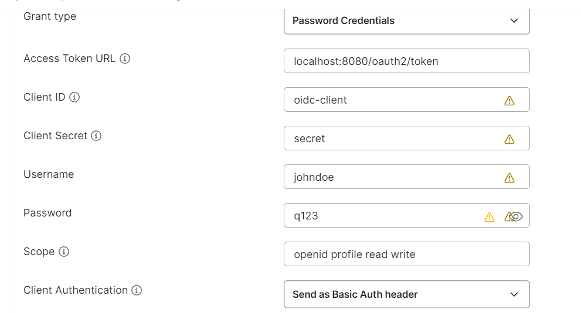
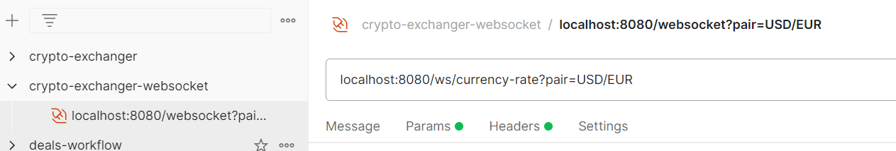

project composition:
1. crypto-exchanger-api - api module for integration purpose
2. crypto-exchanger-app - main app
3. crypto-exchanger-mock - mock (stub) for emulation process (including currency rates charts and payment provider)

startup order:
1. crypto-exchanger-mock
2. crypto-exchanger-app

Predefined user: username: johndoe password: q123 

**Socket connection for currency charts** - localhost:8080/ws/currency-rate?pair=USD/EUR

for simplicity the following assumptions exist:

- 'rate' fields has 2 decimal scale (affects Account and CurrencyRate entities)
- there is a luck of validators which should check amount and rate
- exchanger-mock relays on embedded kafka instead of for standalone kafka or (container kafka)
- there is no docker or docker compose configuration to speed up development
- security auth disabled for ws/currency-rate
- User Role models wasn't established
- tests are obsolete

further development may involve:

- refactoring
  - simplify currency-rate flow. Instead of storing currency rates in db switch on full relay on third party integration
  - r&d problem with spring data repository#getReferencesById() (for ex: CurrencyRateService#create). On each call of the method Hibernate call db, that it shouldn't be doing. Research required
  - OAuth 2.0 can be backed by Keycloak instead of custom OAuthAuthorizationServer implementation
  - reorder and introduce two type rest apis one for external usage and another for external access
  - refactor /api/order/book make it accessible via websocket instead of rest
  - refactoring Transaction entity model. Too complicated entity that required which requires simplification because of relationship with Order
- features
  - implement feature to create a new wallets for user
  - implement a new flow to create a new wallet address
  - introduce database migration tools (liquibase/flyway)
  - add bean validation
  - implement canceling orders (order matching would be affected and required refactoring)
  - implement custom exceptions to provide more clarity in negative cases
  - implement RestContollerAdvice to return more detailed error messages
  - establish role model with different permissions for users 

It was done under:
[Mick Gordon - DOOM soundtrack](https://www.youtube.com/playlist?list=PLbskP5RAOv8iZNrpqyc12gQzhnOfmbpdO)